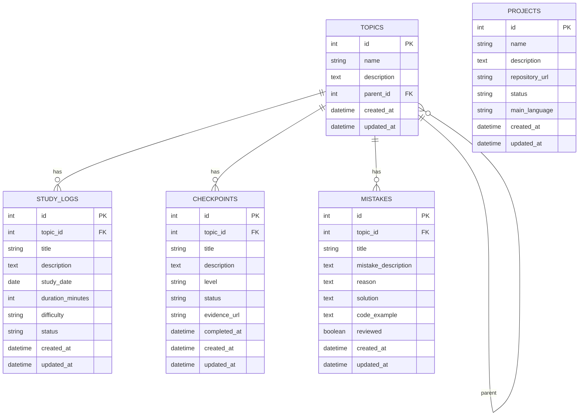

# Guard Study — Micro Ecossistema de Registro e Aprendizado

> **Registre, revise e evolua seu aprendizado em programação.**

O **Guard Study** é um projeto pensado para ser um micro ecossistema de estudos de programação.  
A ideia não é ser apenas uma lista de tarefas, mas sim um sistema para registrar aprendizados, acompanhar evolução, guardar erros, criar checkpoints e conectar teoria com projetos práticos.

Ele nasce como parte do processo de retomada dos estudos em PHP, mas pode crescer para acompanhar qualquer trilha de aprendizado: PHP, JavaScript, Docker, System Design, testes, inglês técnico, algoritmos, banco de dados e outros temas.

---

## 1. Visão do projeto

O Guard Study funciona como um **checkpoint de aprendizado**.

Cada estudo registrado vira histórico.  
Cada erro vira oportunidade de revisão.  
Cada checkpoint mostra que um conteúdo foi realmente aprendido.  
Cada projeto mostra uma evidência prática da evolução.

### Descrição curta

**Português:**

> Uma API para registrar estudos de programação, acompanhar checkpoints de aprendizado, revisar erros e organizar a evolução por projetos.

**Inglês:**

> A learning checkpoint API to track programming studies, mistakes, reviews, and project-based progress.

---

## 2. Objetivo principal

Criar um sistema onde seja possível:

- Registrar sessões de estudo.
- Organizar conteúdos por tópicos.
- Criar checkpoints de aprendizado.
- Registrar erros cometidos durante os estudos.
- Marcar erros como revisados.
- Associar estudos a projetos.
- Visualizar progresso por tema.
- Planejar revisões futuras.
- Usar o próprio projeto como ferramenta de estudo.

---

## 3. Conceito do produto

Pense no Guard Study como um **GitHub dos seus estudos**, mas com foco em aprendizado.

No GitHub, você vê commits, issues, pull requests e histórico do código.  
No Guard Study, você vê logs de estudo, erros, revisões, checkpoints e evidências do que aprendeu.

Exemplo de uso real:

```txt
Tema: PHP > PDO
Estudo: Conexão com banco usando PDO
Erro registrado: Esqueci de configurar PDO::ERRMODE_EXCEPTION
Checkpoint: Consigo criar um repositório com PDO usando prepare/execute?
Evidência: Projeto lista de tarefas com MySQL
Status: Em revisão
```

---

## 4. Semana de descanso criativo

Antes de começar os estudos intensivos, a primeira semana será uma semana de descanso criativo.

A ideia é **não codar pesado** e não se cobrar produtividade alta.  
O foco é organizar o projeto, deixar o terreno preparado e transformar a ansiedade em direção.

### Entregas dessa semana

- [ ] Criar README inicial.
- [ ] Definir descrição do projeto.
- [ ] Criar estrutura de pastas.
- [ ] Criar documentação inicial.
- [ ] Definir entidades principais.
- [ ] Criar DER inicial.
- [ ] Criar lista de rotas da API.
- [ ] Criar issues no GitHub.
- [ ] Definir stack.
- [ ] Planejar MVP.

### O que evitar nessa semana

- Não tentar construir tudo.
- Não transformar descanso em obrigação.
- Não começar pelo front-end complexo.
- Não criar funcionalidades que ainda não fazem parte do MVP.

---

## 5. MVP inicial

O MVP deve ser simples, útil e diretamente conectado ao processo de estudo.

### Módulos do MVP

1. **Topics**
2. **Study Logs**
3. **Checkpoints**
4. **Mistake Notes**

Esses quatro módulos já permitem registrar o essencial:

- O que estou estudando?
- Quando estudei?
- O que preciso provar que aprendi?
- Onde estou errando?

---

# 6. Módulos do sistema

## 6.1 Topics

Os tópicos representam os assuntos estudados.

Exemplos:

```txt
PHP
PHP > Arrays
PHP > Strings
PHP > POO
PHP > Exceções
PHP > PDO
PHP > HTTP
PHP > REST
PHP > MVC
Docker
JavaScript
System Design
Testes Unitários
```

### Campos sugeridos

```txt
id
name
description
parent_id
created_at
updated_at
```

### Regras

- Nome é obrigatório.
- Nome deve ser único dentro do mesmo nível.
- Um tópico pode ter um tópico pai.
- Um tópico pode ter vários logs, checkpoints e erros.

---

## 6.2 Study Logs

Os logs de estudo registram cada sessão de estudo.

Exemplo:

```txt
Data: 12/07/2026
Tema: PHP - Arrays
Tempo estudado: 1h30
Resumo: Revisei arrays associativos e foreach.
Dificuldade: Média
Status: Em progresso
```

### Campos sugeridos

```txt
id
topic_id
title
description
study_date
duration_minutes
difficulty
status
created_at
updated_at
```

### Dificuldades

```txt
easy
medium
hard
```

### Status

```txt
not_started
studying
review_needed
completed
```

### Regras

- O título é obrigatório.
- A duração deve ser maior que zero.
- O tópico precisa existir.
- A data de estudo é obrigatória.
- A dificuldade deve ser uma das opções permitidas.

---

## 6.3 Checkpoints

Checkpoints são provas de aprendizado.

A pergunta central é:

> “Eu consigo demonstrar que aprendi isso?”

Exemplo:

```txt
Checkpoint: Consigo criar uma classe em PHP com atributos privados e construtor?
Tema: POO
Nível: básico
Status: concluído
Evidência: link para arquivo ou projeto
```

### Campos sugeridos

```txt
id
topic_id
title
description
level
status
evidence_url
completed_at
created_at
updated_at
```

### Níveis

```txt
basic
intermediate
advanced
```

### Status

```txt
pending
in_progress
completed
```

### Regras

- Título é obrigatório.
- Tópico é obrigatório.
- Status inicial: `pending`.
- Quando marcado como concluído, deve preencher `completed_at`.
- Evidência é opcional no começo, mas recomendada.

---

## 6.4 Mistake Notes

O caderno de erros é uma das partes mais importantes do Guard Study.

Ele registra o erro, a causa e a correção.

Exemplo:

```txt
Erro: Esqueci de usar PDO::ERRMODE_EXCEPTION
Tema: PDO
Causa: Não configurei o modo de erro da conexão.
Correção: Adicionar ATTR_ERRMODE no construtor do PDO.
```

### Campos sugeridos

```txt
id
topic_id
title
mistake_description
reason
solution
code_example
reviewed
created_at
updated_at
```

### Regras

- Título é obrigatório.
- Descrição do erro é obrigatória.
- Solução é obrigatória.
- `reviewed` começa como `false`.
- O erro pode ser marcado como revisado depois.

---

## 6.5 Reviews

As revisões programadas podem entrar depois do MVP.

A ideia é usar uma revisão espaçada simples:

```txt
1ª revisão: depois de 1 dia
2ª revisão: depois de 3 dias
3ª revisão: depois de 7 dias
4ª revisão: depois de 15 dias
```

### Campos sugeridos

```txt
id
topic_id
study_log_id
mistake_id
checkpoint_id
review_date
status
created_at
updated_at
```

### Status

```txt
pending
done
skipped
```

---

## 6.6 Projects

Os projetos conectam teoria com prática.

Exemplo:

```txt
Projeto: Agenda POO
Tema: Programação Orientada a Objetos
Linguagem: PHP
Status: em andamento
Repositório: link do GitHub
Aprendizados:
- classes
- objetos
- encapsulamento
- construtor
```

### Campos sugeridos

```txt
id
name
description
repository_url
status
main_language
created_at
updated_at
```

### Status

```txt
planned
in_progress
completed
paused
```

---

# 7. Stack recomendada

## 7.1 Back-end

Como o projeto também serve para estudar PHP, a stack ideal é:

```txt
PHP 8+
Slim 4
PDO
MySQL
Composer
Docker
```

### Por que essa stack?

Porque ela treina exatamente os conteúdos importantes do intensivão:

- PHP.
- POO.
- Exceções.
- PDO.
- HTTP.
- REST.
- MVC.
- JSON.
- Estrutura de projeto.
- Banco de dados.
- Docker.

---

## 7.2 Front-end

Para uma segunda fase:

```txt
React
TypeScript
Tailwind CSS
Vite
Axios ou Fetch API
```

### Por que essa stack?

- É simples de iniciar.
- É boa para portfólio.
- Permite criar dashboard.
- Combina com uma API REST.
- Ajuda a treinar organização de componentes.

---

## 7.3 Primeira versão sem front-end

A primeira versão pode ser apenas:

```txt
API + Postman/Insomnia + README bonito
```

Isso evita sobrecarga no início e permite focar no que mais importa: back-end, API, banco e arquitetura.

---

# 8. Arquitetura sugerida

```txt
guard-study/
├── app/
│   ├── Controllers/
│   │   ├── TopicController.php
│   │   ├── StudyLogController.php
│   │   ├── CheckpointController.php
│   │   └── MistakeController.php
│   │
│   ├── Models/
│   │   ├── Topic.php
│   │   ├── StudyLog.php
│   │   ├── Checkpoint.php
│   │   └── Mistake.php
│   │
│   ├── Repositories/
│   │   ├── TopicRepository.php
│   │   ├── PdoTopicRepository.php
│   │   ├── StudyLogRepository.php
│   │   ├── PdoStudyLogRepository.php
│   │   ├── CheckpointRepository.php
│   │   ├── PdoCheckpointRepository.php
│   │   ├── MistakeRepository.php
│   │   └── PdoMistakeRepository.php
│   │
│   ├── Services/
│   │   ├── CheckpointService.php
│   │   └── ReviewService.php
│   │
│   ├── Exceptions/
│   │   ├── ValidationException.php
│   │   ├── NotFoundException.php
│   │   └── RepositoryException.php
│   │
│   ├── Database/
│   │   └── Connection.php
│   │
│   └── Views/
│       └── JsonView.php
│
├── public/
│   └── index.php
│
├── database/
│   ├── schema.sql
│   └── seed.sql
│
├── docs/
│   ├── requirements.md
│   ├── routes.md
│   ├── der.md
│   └── study-plan.md
│
├── docker-compose.yml
├── composer.json
├── .env.example
└── README.md
```

---

# 9. Modelo de dados inicial

## 9.1 Tabela `topics`

```sql
CREATE TABLE topics (
    id INT AUTO_INCREMENT PRIMARY KEY,
    name VARCHAR(100) NOT NULL,
    description TEXT NULL,
    parent_id INT NULL,
    created_at DATETIME NOT NULL DEFAULT CURRENT_TIMESTAMP,
    updated_at DATETIME NULL,
    CONSTRAINT fk_topics_parent
        FOREIGN KEY (parent_id) REFERENCES topics(id)
        ON DELETE SET NULL
);
```

## 9.2 Tabela `study_logs`

```sql
CREATE TABLE study_logs (
    id INT AUTO_INCREMENT PRIMARY KEY,
    topic_id INT NOT NULL,
    title VARCHAR(150) NOT NULL,
    description TEXT NULL,
    study_date DATE NOT NULL,
    duration_minutes INT NOT NULL,
    difficulty ENUM('easy', 'medium', 'hard') NOT NULL DEFAULT 'medium',
    status ENUM('not_started', 'studying', 'review_needed', 'completed') NOT NULL DEFAULT 'studying',
    created_at DATETIME NOT NULL DEFAULT CURRENT_TIMESTAMP,
    updated_at DATETIME NULL,
    CONSTRAINT fk_study_logs_topic
        FOREIGN KEY (topic_id) REFERENCES topics(id)
        ON DELETE CASCADE
);
```

## 9.3 Tabela `checkpoints`

```sql
CREATE TABLE checkpoints (
    id INT AUTO_INCREMENT PRIMARY KEY,
    topic_id INT NOT NULL,
    title VARCHAR(150) NOT NULL,
    description TEXT NULL,
    level ENUM('basic', 'intermediate', 'advanced') NOT NULL DEFAULT 'basic',
    status ENUM('pending', 'in_progress', 'completed') NOT NULL DEFAULT 'pending',
    evidence_url VARCHAR(255) NULL,
    completed_at DATETIME NULL,
    created_at DATETIME NOT NULL DEFAULT CURRENT_TIMESTAMP,
    updated_at DATETIME NULL,
    CONSTRAINT fk_checkpoints_topic
        FOREIGN KEY (topic_id) REFERENCES topics(id)
        ON DELETE CASCADE
);
```

## 9.4 Tabela `mistakes`

```sql
CREATE TABLE mistakes (
    id INT AUTO_INCREMENT PRIMARY KEY,
    topic_id INT NOT NULL,
    title VARCHAR(150) NOT NULL,
    mistake_description TEXT NOT NULL,
    reason TEXT NULL,
    solution TEXT NOT NULL,
    code_example TEXT NULL,
    reviewed TINYINT(1) NOT NULL DEFAULT 0,
    created_at DATETIME NOT NULL DEFAULT CURRENT_TIMESTAMP,
    updated_at DATETIME NULL,
    CONSTRAINT fk_mistakes_topic
        FOREIGN KEY (topic_id) REFERENCES topics(id)
        ON DELETE CASCADE
);
```

## 9.5 Tabela `projects`

```sql
CREATE TABLE projects (
    id INT AUTO_INCREMENT PRIMARY KEY,
    name VARCHAR(120) NOT NULL,
    description TEXT NULL,
    repository_url VARCHAR(255) NULL,
    status ENUM('planned', 'in_progress', 'completed', 'paused') NOT NULL DEFAULT 'planned',
    main_language VARCHAR(50) NULL,
    created_at DATETIME NOT NULL DEFAULT CURRENT_TIMESTAMP,
    updated_at DATETIME NULL
);
```

---

# 10. DER inicial em Mermaid



---

# 11. Rotas da API

## 11.1 Topics

```txt
GET    /topics
GET    /topics/{id}
POST   /topics
PUT    /topics/{id}
DELETE /topics/{id}
```

### Exemplo de criação

```json
{
  "name": "PHP",
  "description": "Estudos de PHP para Programação Web",
  "parent_id": null
}
```

## 11.2 Study Logs

```txt
GET    /study-logs
GET    /study-logs/{id}
POST   /study-logs
PUT    /study-logs/{id}
DELETE /study-logs/{id}
```

### Exemplo de criação

```json
{
  "topic_id": 1,
  "title": "Estudo de arrays associativos",
  "description": "Revisei arrays, foreach e funções principais.",
  "study_date": "2026-07-20",
  "duration_minutes": 90,
  "difficulty": "medium",
  "status": "studying"
}
```

## 11.3 Checkpoints

```txt
GET    /checkpoints
GET    /checkpoints/{id}
POST   /checkpoints
PUT    /checkpoints/{id}
PATCH  /checkpoints/{id}/complete
DELETE /checkpoints/{id}
```

### Exemplo de criação

```json
{
  "topic_id": 1,
  "title": "Consigo criar uma classe PHP com atributos privados?",
  "description": "Criar classe com private, construtor e getters.",
  "level": "basic",
  "status": "pending",
  "evidence_url": null
}
```

## 11.4 Mistakes

```txt
GET    /mistakes
GET    /mistakes/{id}
POST   /mistakes
PUT    /mistakes/{id}
PATCH  /mistakes/{id}/review
DELETE /mistakes/{id}
```

### Exemplo de criação

```json
{
  "topic_id": 1,
  "title": "Esqueci de usar ERRMODE_EXCEPTION",
  "mistake_description": "A conexão PDO não estava lançando exceções.",
  "reason": "Não configurei PDO::ATTR_ERRMODE.",
  "solution": "Adicionar PDO::ATTR_ERRMODE => PDO::ERRMODE_EXCEPTION.",
  "code_example": "$pdo = new PDO($dsn, $user, $pass, [PDO::ATTR_ERRMODE => PDO::ERRMODE_EXCEPTION]);"
}
```

## 11.5 Dashboard futuro

```txt
GET /dashboard/summary
```

### Retorno esperado

```json
{
  "total_study_minutes": 540,
  "completed_checkpoints": 8,
  "pending_checkpoints": 4,
  "unreviewed_mistakes": 3,
  "topics_in_progress": 5
}
```

---

# 12. Padrão de resposta da API

## Sucesso

```json
{
  "success": true,
  "data": {}
}
```

## Erro

```json
{
  "success": false,
  "error": {
    "message": "Título é obrigatório.",
    "type": "ValidationException"
  }
}
```

---

# 13. Regras de status HTTP

```txt
200 OK - busca ou alteração realizada com sucesso
201 Created - criação realizada com sucesso
204 No Content - remoção realizada com sucesso
400 Bad Request - erro de validação
404 Not Found - recurso não encontrado
500 Internal Server Error - erro inesperado
```

---

# 14. Requisitos funcionais

## Topics

- [ ] Criar tópico.
- [ ] Listar tópicos.
- [ ] Buscar tópico por ID.
- [ ] Atualizar tópico.
- [ ] Remover tópico.
- [ ] Permitir subtópicos.

## Study Logs

- [ ] Criar log de estudo.
- [ ] Listar logs.
- [ ] Buscar log por ID.
- [ ] Atualizar log.
- [ ] Remover log.
- [ ] Filtrar por tópico.
- [ ] Filtrar por status.

## Checkpoints

- [ ] Criar checkpoint.
- [ ] Listar checkpoints.
- [ ] Buscar checkpoint por ID.
- [ ] Atualizar checkpoint.
- [ ] Marcar checkpoint como concluído.
- [ ] Remover checkpoint.
- [ ] Filtrar por status.
- [ ] Filtrar por nível.

## Mistakes

- [ ] Criar erro.
- [ ] Listar erros.
- [ ] Buscar erro por ID.
- [ ] Atualizar erro.
- [ ] Marcar erro como revisado.
- [ ] Remover erro.
- [ ] Filtrar erros não revisados.

## Dashboard futuro

- [ ] Exibir total de horas estudadas.
- [ ] Exibir checkpoints concluídos.
- [ ] Exibir erros não revisados.
- [ ] Exibir tópicos em andamento.
- [ ] Exibir próximas revisões.

---

# 15. Requisitos não funcionais

- Código organizado em MVC ou separação similar.
- Uso de POO.
- Uso de PDO para acesso ao banco.
- Uso de prepared statements.
- Tratamento de exceções.
- Retorno em JSON.
- Mensagens de erro claras.
- Configuração via `.env`.
- Projeto executável com Docker.
- README com instruções de instalação.
- Documentação das rotas.
- Código legível e comentado apenas quando necessário.

---

# 16. Fases de desenvolvimento

## Fase 0 — Descanso criativo e documentação

Objetivo: planejar sem se sobrecarregar.

Entregas:

- README.
- Documento do projeto.
- DER.
- Rotas.
- Issues.
- Estrutura de pastas.

## Fase 1 — API base sem banco

Objetivo: criar rotas e controllers com dados mockados.

Entregas:

- Rotas principais.
- Controllers.
- JSON View.
- Respostas padronizadas.

## Fase 2 — Banco de dados e PDO

Objetivo: conectar a API ao MySQL.

Entregas:

- Docker com MySQL.
- `schema.sql`.
- Classe de conexão.
- Repositórios com PDO.
- Prepared statements.

## Fase 3 — Regras de negócio

Objetivo: deixar o sistema mais fiel ao uso real.

Entregas:

- Validações.
- Exceções personalizadas.
- Checkpoint complete.
- Mistake review.
- Filtros simples.

## Fase 4 — Dashboard

Objetivo: criar visão geral do progresso.

Entregas:

- Endpoint `/dashboard/summary`.
- Métricas de estudo.
- Contagem de erros pendentes.
- Total de checkpoints.

## Fase 5 — Front-end

Objetivo: criar interface visual.

Entregas:

- Dashboard.
- Página de tópicos.
- Página de logs.
- Página de checkpoints.
- Página de erros.
- Formulários.
- Consumo da API.

## Fase 6 — CLI opcional

Objetivo: criar uma ferramenta de terminal.

Exemplos:

```bash
guard log "Estudei arrays em PHP por 1h"
guard checkpoint complete 3
guard mistake add
```

---

# 17. Issues iniciais para o GitHub

## Documentação

- [ ] Criar README inicial.
- [ ] Criar documentação de requisitos.
- [ ] Criar documentação das rotas.
- [ ] Criar DER inicial.
- [ ] Criar checklist do MVP.

## Setup

- [ ] Configurar Composer.
- [ ] Instalar Slim 4.
- [ ] Criar `.env.example`.
- [ ] Criar Docker Compose.
- [ ] Criar estrutura de pastas.

## Banco

- [ ] Criar `schema.sql`.
- [ ] Criar tabela `topics`.
- [ ] Criar tabela `study_logs`.
- [ ] Criar tabela `checkpoints`.
- [ ] Criar tabela `mistakes`.
- [ ] Criar seeds iniciais.

## API

- [ ] Criar rotas de topics.
- [ ] Criar rotas de study logs.
- [ ] Criar rotas de checkpoints.
- [ ] Criar rotas de mistakes.
- [ ] Padronizar respostas JSON.
- [ ] Padronizar tratamento de erros.

## Regras

- [ ] Validar campos obrigatórios.
- [ ] Criar `ValidationException`.
- [ ] Criar `NotFoundException`.
- [ ] Criar `RepositoryException`.
- [ ] Implementar conclusão de checkpoint.
- [ ] Implementar revisão de erro.

## Futuro

- [ ] Criar dashboard.
- [ ] Criar front-end.
- [ ] Criar autenticação.
- [ ] Criar revisão espaçada.
- [ ] Criar CLI.

---

# 18. README inicial sugerido

```md
# Guard Study

Guard Study is a learning checkpoint API built to track programming studies, mistakes, reviews, and project-based progress.

## About

This project was created as a micro ecosystem for study management.  
It helps developers register study sessions, organize topics, track learning checkpoints, review mistakes, and connect knowledge with practical projects.

## Main Features

- Study logs
- Learning topics
- Checkpoints
- Mistake notes
- Review tracking
- Project-based learning progress

## Tech Stack

- PHP 8+
- Slim 4
- PDO
- MySQL
- Docker
- Composer

## Project Status

Planning / MVP

## Purpose

Guard Study is also part of a personal PHP learning journey, using the project itself as a way to practice:

- PHP
- Object-Oriented Programming
- Exceptions
- PDO
- HTTP
- REST
- MVC
- JSON APIs

## License

MIT
```

---

# 19. Tópicos para o GitHub

```txt
php
slim-framework
pdo
mysql
rest-api
learning-tracker
study-tracker
developer-tools
mvc
backend
programming-study
checkpoint
docker
api
```

---

# 20. Prompt para o back-end

Use este prompt para pedir a uma IA/Codex que implemente o back-end.

```txt
Você é um desenvolvedor back-end especialista em PHP 8, Slim 4, PDO, MySQL, APIs REST e arquitetura MVC.

Quero criar o projeto Guard Study API.

Contexto:
O Guard Study é uma API para registrar estudos de programação, acompanhar checkpoints de aprendizado, revisar erros e organizar evolução por tópicos e projetos. A primeira versão será um MVP focado em quatro módulos: Topics, Study Logs, Checkpoints e Mistake Notes.

Objetivo:
Criar uma API REST em PHP 8+ usando Slim 4, PDO e MySQL, com estrutura organizada, POO, exceções personalizadas, prepared statements e respostas JSON padronizadas.

Stack obrigatória:
- PHP 8+
- Slim 4
- PDO
- MySQL
- Composer
- Docker e docker-compose
- .env para configuração
- JSON como formato de resposta

Estrutura esperada:
guard-study/
├── app/
│   ├── Controllers/
│   ├── Models/
│   ├── Repositories/
│   ├── Services/
│   ├── Exceptions/
│   ├── Database/
│   └── Views/
├── public/
│   └── index.php
├── database/
│   ├── schema.sql
│   └── seed.sql
├── docs/
├── docker-compose.yml
├── composer.json
├── .env.example
└── README.md

Entidades do MVP:

1. Topic
Campos:
- id
- name
- description
- parent_id
- created_at
- updated_at

2. StudyLog
Campos:
- id
- topic_id
- title
- description
- study_date
- duration_minutes
- difficulty: easy, medium, hard
- status: not_started, studying, review_needed, completed
- created_at
- updated_at

3. Checkpoint
Campos:
- id
- topic_id
- title
- description
- level: basic, intermediate, advanced
- status: pending, in_progress, completed
- evidence_url
- completed_at
- created_at
- updated_at

4. Mistake
Campos:
- id
- topic_id
- title
- mistake_description
- reason
- solution
- code_example
- reviewed
- created_at
- updated_at

Rotas obrigatórias:

Topics:
GET    /topics
GET    /topics/{id}
POST   /topics
PUT    /topics/{id}
DELETE /topics/{id}

Study Logs:
GET    /study-logs
GET    /study-logs/{id}
POST   /study-logs
PUT    /study-logs/{id}
DELETE /study-logs/{id}

Checkpoints:
GET    /checkpoints
GET    /checkpoints/{id}
POST   /checkpoints
PUT    /checkpoints/{id}
PATCH  /checkpoints/{id}/complete
DELETE /checkpoints/{id}

Mistakes:
GET    /mistakes
GET    /mistakes/{id}
POST   /mistakes
PUT    /mistakes/{id}
PATCH  /mistakes/{id}/review
DELETE /mistakes/{id}

Dashboard futuro, se der tempo:
GET /dashboard/summary

Padrão de resposta de sucesso:
{
  "success": true,
  "data": {}
}

Padrão de resposta de erro:
{
  "success": false,
  "error": {
    "message": "Mensagem clara do erro",
    "type": "ValidationException"
  }
}

Regras:
- Usar POO.
- Usar interfaces para repositórios.
- Criar implementações PDO dos repositórios.
- Usar prepared statements.
- Não concatenar SQL com entrada do usuário.
- Criar classe Database/Connection.php para conexão PDO.
- Usar PDO::ATTR_ERRMODE => PDO::ERRMODE_EXCEPTION.
- Criar JsonView para padronizar respostas.
- Criar ValidationException, NotFoundException e RepositoryException.
- Retornar status HTTP corretos:
  - 200 para busca e atualização
  - 201 para criação
  - 204 para remoção
  - 400 para validação
  - 404 para recurso não encontrado
  - 500 para erro inesperado
- Criar schema.sql com as tabelas.
- Criar seed.sql com dados iniciais.
- Criar README com instruções de instalação e execução.
- Criar documentação simples das rotas em docs/routes.md.

Critérios de qualidade:
- Código simples, didático e organizado.
- Não usar framework ORM.
- Não usar Laravel.
- Manter a implementação adequada para um projeto acadêmico e de portfólio.
- Priorizar clareza em vez de abstração excessiva.
- Separar Controller, Model, Repository, Exception e View.
- O projeto deve rodar com docker-compose up.

Comece criando a estrutura completa do projeto, os arquivos de configuração, o banco de dados, as classes base e depois implemente as rotas do MVP.
```

---

# 21. Prompt para o front-end

Use este prompt para pedir a uma IA/Codex que implemente o front-end.

```txt
Você é um desenvolvedor front-end especialista em React, TypeScript, Vite, Tailwind CSS e consumo de APIs REST.

Quero criar o front-end do projeto Guard Study.

Contexto:
O Guard Study é um micro ecossistema para registrar estudos de programação, acompanhar checkpoints de aprendizado, revisar erros e organizar evolução por tópicos e projetos.

A API back-end possui os seguintes módulos:
- Topics
- Study Logs
- Checkpoints
- Mistake Notes
- Dashboard Summary

Objetivo:
Criar uma interface web simples, bonita e funcional para consumir a API Guard Study.

Stack obrigatória:
- React
- TypeScript
- Vite
- Tailwind CSS
- React Router
- Fetch API ou Axios
- Componentização limpa

Estilo visual:
- Interface minimalista.
- Visual organizado e leve.
- Aparência de dashboard de produtividade/dev.
- Layout responsivo.
- Cards com métricas.
- Tabelas simples.
- Formulários claros.
- Estados de loading e erro.
- Evitar excesso de animações.
- Usar textos em português.

Páginas obrigatórias:

1. Dashboard
Rota: /
Deve exibir:
- Total de horas estudadas
- Checkpoints concluídos
- Checkpoints pendentes
- Erros não revisados
- Tópicos em andamento
- Últimos logs de estudo
- Últimos erros registrados

2. Topics
Rota: /topics
Funcionalidades:
- Listar tópicos
- Criar tópico
- Editar tópico
- Remover tópico
- Exibir subtópicos, se existirem

3. Study Logs
Rota: /study-logs
Funcionalidades:
- Listar logs de estudo
- Criar log
- Editar log
- Remover log
- Filtrar por tópico
- Filtrar por status

Campos:
- topic_id
- title
- description
- study_date
- duration_minutes
- difficulty
- status

4. Checkpoints
Rota: /checkpoints
Funcionalidades:
- Listar checkpoints
- Criar checkpoint
- Editar checkpoint
- Remover checkpoint
- Marcar como concluído
- Filtrar por status
- Filtrar por nível

Campos:
- topic_id
- title
- description
- level
- status
- evidence_url

5. Mistakes
Rota: /mistakes
Funcionalidades:
- Listar erros
- Criar erro
- Editar erro
- Remover erro
- Marcar como revisado
- Filtrar por revisado/não revisado

Campos:
- topic_id
- title
- mistake_description
- reason
- solution
- code_example
- reviewed

Estrutura sugerida:
src/
├── api/
│   └── client.ts
├── components/
│   ├── Layout.tsx
│   ├── Sidebar.tsx
│   ├── Header.tsx
│   ├── StatCard.tsx
│   ├── EmptyState.tsx
│   ├── Loading.tsx
│   └── ErrorMessage.tsx
├── pages/
│   ├── Dashboard.tsx
│   ├── Topics.tsx
│   ├── StudyLogs.tsx
│   ├── Checkpoints.tsx
│   └── Mistakes.tsx
├── types/
│   └── index.ts
├── hooks/
│   └── useFetch.ts
├── App.tsx
├── main.tsx
└── index.css

Rotas da API esperadas:
GET    /topics
POST   /topics
PUT    /topics/{id}
DELETE /topics/{id}

GET    /study-logs
POST   /study-logs
PUT    /study-logs/{id}
DELETE /study-logs/{id}

GET    /checkpoints
POST   /checkpoints
PUT    /checkpoints/{id}
PATCH  /checkpoints/{id}/complete
DELETE /checkpoints/{id}

GET    /mistakes
POST   /mistakes
PUT    /mistakes/{id}
PATCH  /mistakes/{id}/review
DELETE /mistakes/{id}

GET /dashboard/summary

Padrão de resposta da API:
Sucesso:
{
  "success": true,
  "data": {}
}

Erro:
{
  "success": false,
  "error": {
    "message": "Mensagem do erro",
    "type": "ValidationException"
  }
}

Regras:
- Criar tipos TypeScript para Topic, StudyLog, Checkpoint, Mistake e DashboardSummary.
- Criar um client HTTP centralizado.
- Tratar loading e erro em todas as páginas.
- Criar formulários simples.
- Validar campos obrigatórios no front antes de enviar.
- Usar variáveis de ambiente para URL da API.
- Criar README com instruções de instalação.
- Evitar bibliotecas complexas no MVP.
- Manter o código didático, limpo e fácil de evoluir.
- O front deve funcionar mesmo com poucos dados.
- Criar mensagens vazias amigáveis, como "Nenhum estudo registrado ainda".

Comece criando o projeto Vite com React + TypeScript, configure Tailwind, crie o layout principal e depois implemente as páginas na ordem:
1. Dashboard
2. Topics
3. Study Logs
4. Checkpoints
5. Mistakes
```

---

# 22. Próximos passos recomendados

## Durante a semana de descanso

- [ ] Subir este documento para `docs/guard-study-plan.md`.
- [ ] Criar o README inicial.
- [ ] Criar issues com base na seção 17.
- [ ] Criar o DER no README ou em `docs/der.md`.
- [ ] Não se cobrar para implementar tudo agora.

## Quando começar o desenvolvimento

Ordem recomendada:

1. Setup do projeto.
2. Docker + MySQL.
3. Slim funcionando com rota `/health`.
4. Banco com `schema.sql`.
5. CRUD de Topics.
6. CRUD de Study Logs.
7. CRUD de Checkpoints.
8. CRUD de Mistakes.
9. Dashboard.
10. Front-end.

---

# 23. Frase guia do projeto

> **Guard Study é um sistema para guardar o caminho do aprendizado, não apenas o resultado final.**

Ou, na versão mais dev:

> **Every mistake becomes a checkpoint. Every checkpoint becomes progress.**
